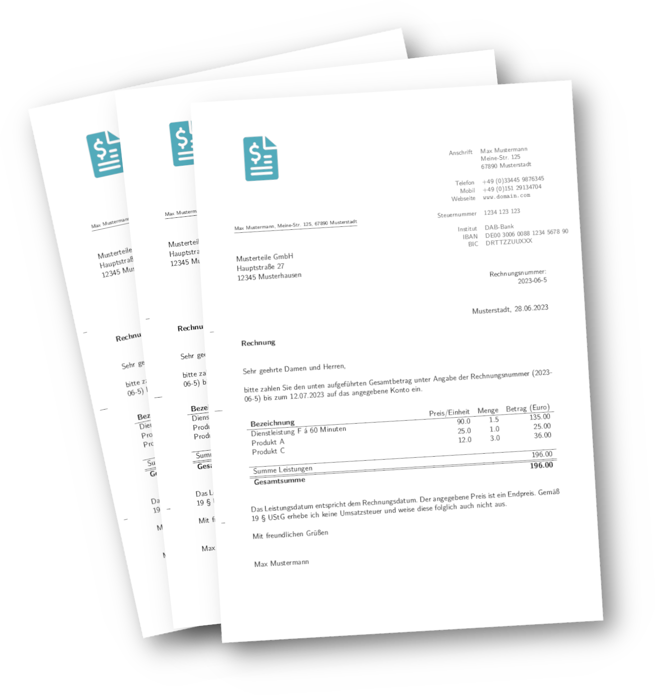

# Rechnungs-Assistent

## Erstelle Rechnungen im Handumdrehen



Rechnungs-Assistent für vorwiegend deutsche Kleinunternehmer, da noch keine Steuerberechnung inkludiert ist.
Dieses Feature wird in den nächsten Versionen nachgereicht.
Kunden und Artikel können auch von außen in .csv Dateien unter "Dokumente/Rechnungen/data" geschrieben werden, um diese für den Rechnungs-Assistent zu importieren.
Ebenfalls ist der Rechnungs-Assistent komplett Skript fähig, dazu einfach `rechnungs-assistent --help` eingeben.

## How to run for development

```bash
# Latex dependencies
sudo apt install texlive-latex-recommended texlive-lang-german

# Flutter:
sudo apt install snapd
snap install flutter --classic


# First session (Frontend):
cd src
flutter run

# Second session (Backend, that the pdflatex will be called at the right time):
cd src
python3 runner.py
```

## How to build deb package

```bash
bash build-deb.sh
```
